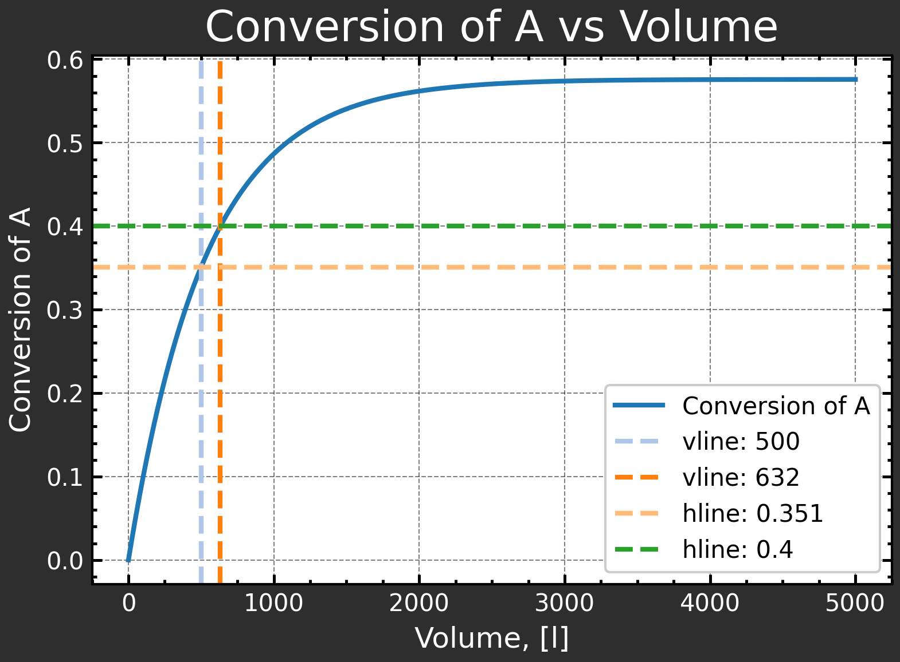
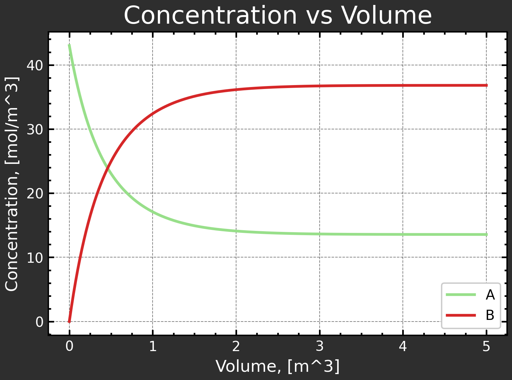
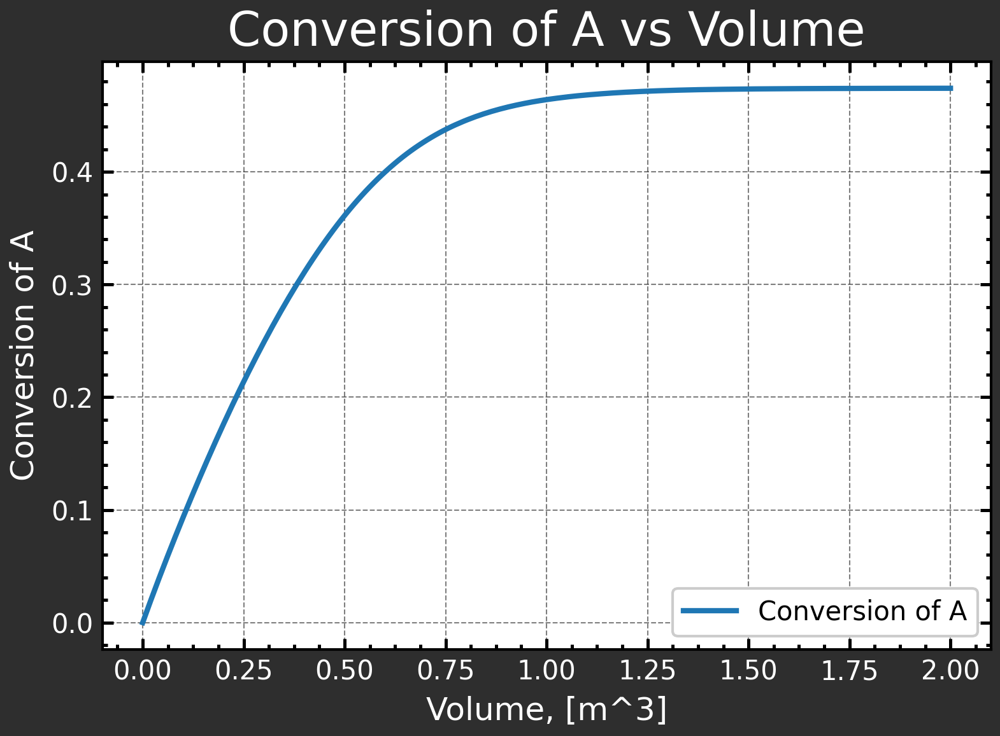
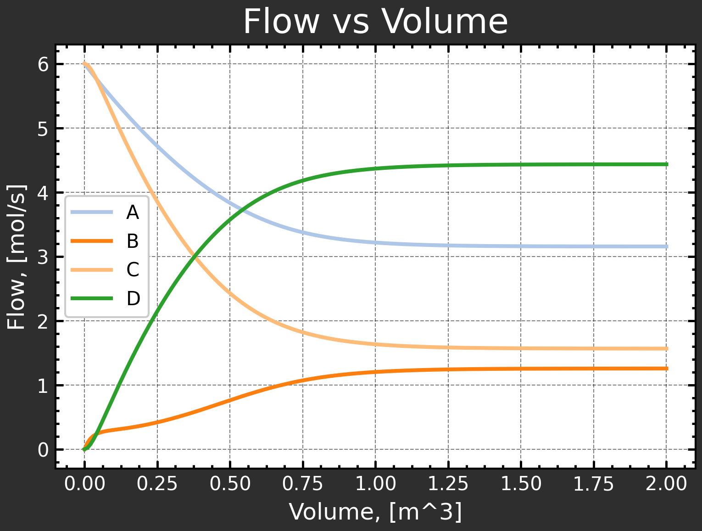
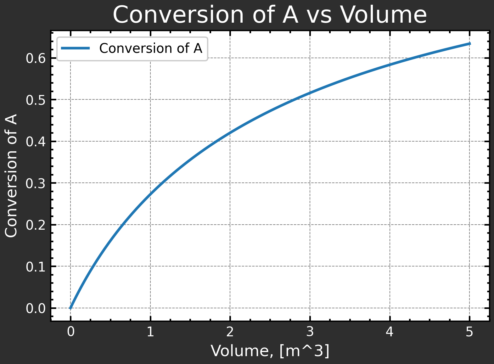
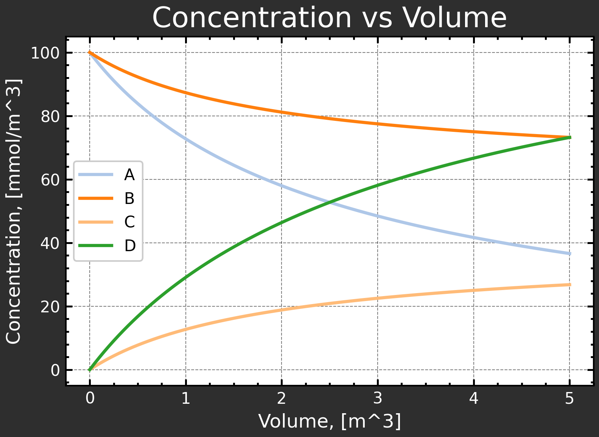

# Process Engineering Toolkit (PET)

## Project Description

A lightweight modular toolkit for first-principles process design, equipment sizing, and operating window exploration of chemical unit operations.

PET aims to provide simple, physics-based modeling tools for rapid conceptual process development.

## Table of Contents

- [Motivation](#Motivation)
- [Project Status](#project-status)
    - [Planned Progression](#planned-progression)
- [Repository Structure](#repository-structure)
- [Example: Single-reaction system (PFR)](#example-single-reaction-system-pfr)
- [Example: Multi-reaction system (PFR)](#example-multi-reaction-system-pfr)
- [Example: Multi-reaction system, irreversible (CSTR)](#example-multi-reaction-system-irreversible-cstr)

## Motivation

Modern process engineering tools are often:

* Heavy
* Black-box
* Difficult to extend

PET is designed as:

* Modular
* First-principles focused
* Easy to extend with custom unit operations

## Project Status

Currently, PET works for PFR and CSTR with single and multi-reaction systems. Both irreversible and reversible reactions can be defined. Mass action and power law kinetics are available, and rate constants can be supplied directly or via Arrhenius parameters. New examples showcasing all capabilities will be added to the README over time, but most are already in the exploration notebook.

New functionalities will added according to the Planned Progression below (not in order necessarily). 

### Planned Progression

- [X] Add new functionalities to PFR
    - [X] Determine required volume given target conversion
    - [X] Determine conversion profile
    - [X] Determine conversion for specific volume
- [X] Add liquid phase reactions
- [ ] Add new general reactor functionalities
    - [X] Automatic unit handling/conversion using pint
    - [ ] Additional rate laws
        - [X] Power law
        - [ ] Michaelis-Menten
    - [X] Plotting (including target folder for saving plots)
- [ ] Add additional units
    - [X] CSTR
    - [ ] PBR
    - [ ] Batch
- [ ] Add recirculation
- [ ] Add serial and parallel reactor unit processing
- [ ] Add heating / cooling capabilities
- [ ] Add separation/filtration processes
- [ ] Add high-level infrastructure to manage parameter exploration
    - [ ] Grid search
    - [ ] Design of Experiments
    - [ ] Bayesian Optimization
- [ ] Add piping and pumps
- [ ] Add catalyst consumption models


## Repository structure

```process_engineering_toolkit/
│
├── docs/                    # Documentation
│   └── images/              # Saved plots for documentation
├── notebooks/               # Explorations from development
├── src/
│   └── process_engineering_toolkit/
│       ├── __init__.py
│       ├── stream.py        # Stream class definition
│       ├── reactions.py     # Reaction and Reactions classes
│       ├── rate_laws.py     # Rate laws
│       └── reactors/
│           ├── __init__.py
│           ├── base.py      # Reactor base class
│           ├── pfr.py       # Plug Flow Reactor
│           ├── cstr.py      # Continuous Stirred Tank Reactor
│           ├── batch.py     # Batch Reactor (planned)
│           └── pbr.py       # Packed Bed Reactor (planned)
│
├── README.md                # This file
└── pyproject.toml           # Project configuration and dependencies
```

## Example: Single-reaction system (PFR)

This example demonstrates how to define, reactions, streams, as well as plug flow reactor and how to simulate.

### Defining and solving a PFR reactor system

```python
import matplotlib.pyplot as plt
from pet import Reactions, Stream, PFR

# -----------------------------
# 1. Define reactions
# -----------------------------
# Currently, two options are available.
# 1) Don't specify units: In this case the toolkit computes everything as is - The user will have to ensure unit consistency.
# 2) Specify units: The toolkit will convert to SI units internally, but the user can work with more intuitive units.
# Note: If using option 2, the user currently still has to provide rate constants/parameters in SI units. 
# The function standardize_units, which converts to desired units (and then strips them),
# can be used as below. 
kf = 0.3 / min              # Forward rate constant
kb = 3 * L / min / mol      # Backward rate constant
kf = standardize_units(kf, 1 / s)           # Convert to SI units and strip units
kb = standardize_units(kb, m**3 / s / mol)  # Convert to SI units and strip units

reactions = [
    {"equation": "A <-> 2B", "rate_law": "mass_action", "parameters": {"kf": kf, "kb": kb}}
    ]

rxns = Reactions(reactions)

# -----------------------------
# 2. Define inlet stream
# -----------------------------
s1 = Stream("Inlet1", total_flow = 20 * mol / min, composition = {"A": 0.6, "I": 0.4}) # I: Inert

# -----------------------------
# 3. Define reactor conditions
# -----------------------------
parameters = {
    "phase": "gas",       # Gas or liquid
    "T": 340 * K,         # Kelvin
    "P": 2 * 101325 * Pa  # Pascal
}

# -----------------------------
# 4. Instantiate reactor
# -----------------------------
pfr = PFR(rxns, inlet_streams=s1, parameters=parameters)

# -----------------------------
# 5. Key calculations
# -----------------------------
# Equilibrium conversion of A
Xeq = pfr.equilibrium_conversion("A")
print(f"{'Equilibrium conversion':<45}: {Xeq:.3f}")

# Solve reactor over volume range [0, 5] m3
pfr.solve(V_span=(0, 5))  # m3 - Must solve reactor before below calculations can be performed

# Conversion at specific volume
X = pfr.conversion_at_volume("A", 0.5)
print(f"{'Conversion at 0.5 m3':<45}: {X:.3f}")

# Required volume for target conversion
V_req = pfr.volume_for_conversion("A", 0.4)
print(f"{'Required PFR volume for 40% conversion, m3':<45}: {V_req:.3f}")
```

**Output:**

```text
Equilibrium conversion                       : 0.576
Conversion at 0.5 m3                         : 0.351
Required PFR volume for 40% conversion, m3   : 0.632
```

### Plotting

Convenient plotting is facilitated by the ReactorPlotter. This works with the profile output from the PFR object.

```python
# Extract profiles
profile = pfr.profile(species_for_conversion="A") # The limiting reactant should be chosen as species for conversion.

# The ReactorPlotter can be used to visualize the conversion profile and add vertical/horizontal lines to indicate key values,
# such as the required volume for a target conversion or the equilibrium conversion.
plotter = ReactorPlotter()
```

The ReactorPlotter provides a simple method of plotting various results from the profile dict while still allowing full control if desired 
(Saving capabilities are also provided). In these examples the focus is on simple usecases. 

For a more detailed overview of how to use this object, the notebook 'exploration' is currently the best source.

**Conversion vs PFR volume**

```python
plotter.plot(profile, "volume", "conversion", legend_loc='best', vlines=[0.5*1000, V_req*1000], hlines=[X, 0.4], x_unit="L")
```



**Concentration vs PFR volume**

```python
# Excluding y_species will plot concentration profiles of all species in the reactor (including the inert).
plotter.plot(profile, "volume", "concentration", y_species=["A", "B"])
```



## Example: Multi-reaction system (PFR)

This example demonstrates how to define and simulate a plug flow reactor with:
- multiple simultaneous reactions
- different kinetic models (mass-action and custom power-law)
- multiple inlet streams

```python
# -----------------------------
# 1. Define reactions
# -----------------------------
# Rate parameters
kf2 = 10 * L / (mol * min)
kb2 = 1 * L / (mol * min)
kf2 = standardize_units(kf2, m**3 / (mol * s))  # Convert to SI units and strip units
kb2 = standardize_units(kb2, m**3 / (mol * s))     # Convert to SI units and strip units

# Custom power-law expression for B + C <-> D
# It should be noted that kf and kb in power law rate expressions are only allowed for the intuition's sake. 
# kf and kb are stripped under the hood and don't make an actual difference - Thus, you can also choose to leave them out. 
power_expr = "B * C - D^2"

reactions = [
    {"equation": "A <-> 2B",    "rate_law": "mass_action",  "parameters": {"kf": kf, "kb": kb}},
    {"equation": "B + C <-> D", "rate_law": "power",        "parameters": {"expression": power_expr, "kf": kf2, "kb": kb2}}
    ]

rxns = Reactions(reactions)

# -----------------------------
# 2. Define inlet stream
# -----------------------------
# Two independent feeds containing different reactants
s1 = Stream("Inlet1", total_flow=10, composition={"A": 0.6, "I": 0.4}) # I = inert
s2 = Stream("Inlet2", total_flow=10, composition={"C": 0.6, "I": 0.4}) # I = inert

# -----------------------------
# 3. Define reactor conditions
# -----------------------------
# Note: For liquid phase reactions, the user should specify volumetric flow (v0) instead of T and P.
# Note: Physical consistency between inlet streams and volumetric flow of reactors is not currently enforced.
#       This will be adressed in an upcoming update.
parameters = {
    "phase": "liquid",    # Gas or liquid
    "v0": 0.005 # m3/s.
}

# -----------------------------
# 4. Instantiate reactor
# -----------------------------
pfr = PFR(rxns, inlet_streams=[s1, s2], parameters=parameters)

# -----------------------------
# 5. Key calculations
# -----------------------------
# An initial guess can be provided if the solver in .equilibrium_conversion has trouble converging. 
# The initial guess should be provided as a dictionary with species as keys and flows as values.
# If a species is left out, the inlet flow will be used as initial guess for that species (nice for inerts).
# initial_guess = {"A": 3, "B": 1, "C": 2, "D": 4} # TIP: Solve the reactor with a V_span as below and use the final flows as initial guess
Xeq = pfr.equilibrium_conversion("A") # initial_guess=initial_guess
print(f"{'Equilibrium conversion':<45}: {Xeq:.3f}")

# Solve reactor over volume range [0, 2] m3
pfr.solve(V_span=(0, 2))  # m3 - Must solve reactor before below calculations can be performed

# Conversion at specific volume
X = pfr.conversion_at_volume("A", 0.5)
print(f"{'Conversion at 0.5 m3':<45}: {X:.3f}")

# Required volume for target conversion
V_req = pfr.volume_for_conversion("A", 0.4)
print(f"{'Required PFR volume for 40% conversion, m3':<45}: {V_req:.3f}")
```

**Output:**

```text
Equilibrium conversion                       : 0.474
Conversion at 0.5 m3                         : 0.361
Required PFR volume for 40% conversion, m3   : 0.601
```

### Plotting

```python
# Extract profiles
profile = pfr.profile(species_for_conversion="A") # The limiting reactant should be chosen as species for conversion.
# Instantiate plotter
plotter = ReactorPlotter()
```

**Conversion vs PFR volume**

```python
plotter.plot(profile, "volume", "conversion")
```



**Concentration vs PFR volume**

```python
# Excluding y_species will plot concentration profiles of all species in the reactor (including the inert).
plotter.plot(profile, "volume", "flow", legend_loc='best', y_species=["A", "B", "C", "D"])
```



## Example: Multi-reaction system, irreversible (CSTR)

```python
k1 = 0.01 * m**3 / mol / s
k2 = 0.001 / s
k1 = standardize_units(k1, m**3 / mol / s)           # Convert to SI units and strip units
k2 = standardize_units(k2, 1 / s)  # Convert to SI units and strip units

# -----------------------------
# 1. Define reactions
# -----------------------------
reactions = [
    {"equation": "A + B -> C", "rate_law": "mass_action",  "parameters": {"kf": k1}},
    {"equation": "A -> 2D",    "rate_law": "mass_action",  "parameters": {"kf": k2}}
    ]

rxns = Reactions(reactions)

# -----------------------------
# 2. Define inlet stream
# -----------------------------
# Determine molar flow from v = 0.005 m3/s and CA0 = CB0 = 0.1 mol/m3
CA0 = CB0 = 0.1 * mol / m**3
molar_flow = 0.005 * m**3 / s * CA0  # mol/s

# Two independent feeds containing different reactants
s = Stream("Inlet1", total_flow=molar_flow*2, composition={"A": 0.5, "B": 0.5})

# -----------------------------
# 3. Define reactor conditions
# -----------------------------
parameters = {
    "phase": "liquid",
    "v0": 0.005 # m3/s
}

# -----------------------------
# 4. Instantiate reactor
# -----------------------------
cstr = CSTR(rxns, inlet_streams=s, parameters=parameters)

# -----------------------------
# 5. Key calculations
# -----------------------------
# Equilibrium conversion of A
Xeq = cstr.equilibrium_conversion("A")
print(f"{'Equilibrium conversion':<45}: {Xeq:.3f}")

# Solve reactor over volume range [0, 10] m3
cstr.solve(V=(0, 5))  # m3 - Must solve reactor before below calculations can be performed

# Conversion at specific volume
X = cstr.conversion_at_volume("A", 5)
print(f"{'Conversion at 5 m3':<45}: {X:.3f}")

# Required volume for target conversion
V_req = cstr.volume_for_conversion("A", 0.4)
print(f"{'Required CSTR volume for 40% conversion, m3':<45}: {V_req:.3f}")
```

**Output**

```text
Equilibrium conversion                       : 1.000
Conversion at 5 m3                           : 0.634
Required CSTR volume for 40% conversion, m3  : 1.832
```

### Plotting

```python
cstr_plotter = ReactorPlotter()
cstr_profile = cstr.profile(species_for_conversion="A")
cstr_plotter.plot(cstr_profile, "volume", "conversion", legend_loc='best')
cstr_plotter.plot(cstr_profile, "volume", "concentration", legend_loc='best', y_unit="mmol/m^3")
```

**Conversion vs CSTR volume**



**Concentration vs PFR volume**

