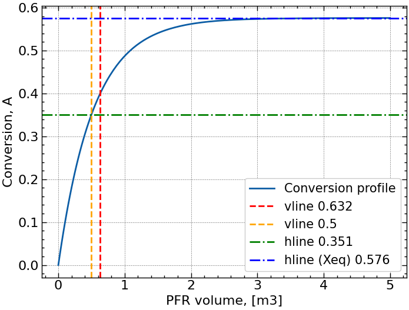
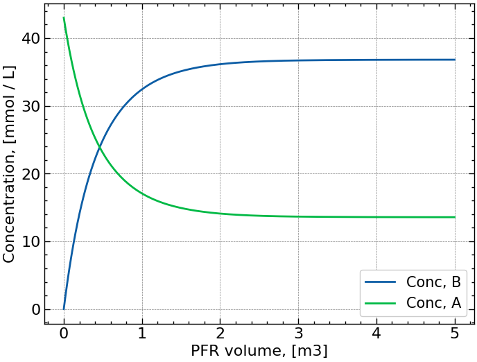
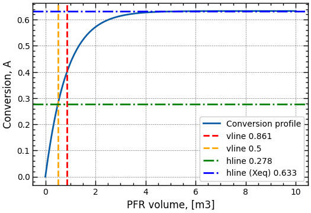
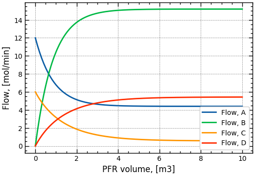

# Process Engineering Toolkit (PET)

## Project Description

A lightweight modular toolkit for first-principles process design, equipment sizing, and operating window exploration of chemical unit operations.

PET aims to provide simple, physics-based modeling tools for rapid conceptual process development.

## Table of Contents

- [Motivation](#Motivation)
- [Project Status](#project-status)
    - [Planned Progression](#planned-progression)
- [Repository Structure](#repository-structure)
- [Example: Single-reaction system (PFR)](#example-single-reaction-system-pfr)
- [Example: Multi-reaction system (PFR)](#example-multi-reaction-system-pfr)

## Motivation

Modern process engineering tools are often:

* Heavy
* Black-box
* Difficult to extend

PET is designed as:

* Modular
* First-principles focused
* Easy to extend with custom unit operations

## Project Status

New functionalities will added according to the Planned Progression below (not in order necessarily). 

New rate law framework has been finalized and tested. Likewise, Reactor base class and PFR class funcionalities have been streamlined for better scalability and extensibility.

### Planned Progression

- [X] Add new functionalities to PFR
    - [X] Determine required volume given target conversion
    - [X] Determine conversion profile
    - [X] Determine conversion for specific volume
- [ ] Add liquid phase reactions
- [ ] Add new general reactor functionalities
    - [ ] Automatic unit handling/conversion using pint
    - [ ] Additional rate laws
        - [X] Power law
        - [ ] Michaelis-Menten
    - [ ] Plotting (including target folder for saving plots)
- [ ] Add additional units
    - [ ] CSTR
    - [ ] PBR
    - [ ] Batch
- [ ] Add recirculation
- [ ] Add serial and parallel reactor unit processing
- [ ] Add heating / cooling capabilities
- [ ] Add separation/filtration processes
- [ ] Add high-level infrastructure to manage parameter exploration
    - [ ] Grid search
    - [ ] Design of Experiments
    - [ ] Bayesian Optimization
- [ ] Add piping and pumps
- [ ] Add catalyst models


## Repository structure

```process_engineering_toolkit/
│
├── docs/                    # Documentation
├── notebooks/               # Explorations from development
├── plots/                   # Saved plots
├── src/
│   └── process_engineering_toolkit/
│       ├── __init__.py
│       ├── stream.py        # Stream class definition
│       ├── reactions.py     # Reaction and Reactions classes
│       ├── rate_laws.py     # Rate laws
│       └── reactors/
│           ├── __init__.py
│           ├── base.py      # Reactor base class
│           ├── pfr.py       # Plug Flow Reactor
│           ├── cstr.py      # CSTR (planned)
│           ├── batch.py     # Batch Reactor (planned)
│           └── pbr.py       # Packed Bed Reactor (planned)
│
├── README.md                # This file
└── pyproject.toml           # Project configuration and dependencies
```

## Example: Single-reaction system (PFR)

This example demonstrates how to define, reactions, streams, as well as plug flow reactor and how to simulate.

### Defining and solving a PFR reactor system

```python
import matplotlib.pyplot as plt
from pet import Reactions, Stream, PFR

# -----------------------------
# 1. Define reactions
# -----------------------------
reactions = [
    {"equation": "A <-> 2B", "rate_law": "mass_action", "parameters": {"kf": 0.3, "kb": 0.003}}
    ]

rxns = Reactions(reactions)

# -----------------------------
# 2. Define inlet stream
# -----------------------------
s1 = Stream("Inlet1", total_flow = 20, composition = {"A": 0.6, "I": 0.4}) # I: Inert

# -----------------------------
# 3. Define reactor conditions
# -----------------------------
parameters = {
    "phase": "gas",    # Only gas is supported so far
    "T": 340,          # K
    "P": 2 * 101325    # Pa
}

# -----------------------------
# 4. Instantiate reactor
# -----------------------------
pfr = PFR(rxns, inlet_streams=s1, parameters=parameters)

# -----------------------------
# 5. Key calculations
# -----------------------------

# Equilibrium conversion
Xeq = pfr.equilibrium_conversion("A")
print(f"{'Equilibrium conversion':<45}: {Xeq:.3f}")

# Solve reactor over volume range [0; 5] m3
pfr.solve(V_span=(0, 5))  # m3 - Must solve reactor before below calculations can be performed

# Conversion at specific volume
X = pfr.conversion_at_volume("A", 0.5)
print(f"{'Conversion at 0.5 m3':<45}: {X:.3f}")

# Required volume for target conversion
V_req = pfr.volume_for_conversion("A", 0.4)
print(f"{'Required PFR volume for 40% conversion, m3':<45}: {V_req:.3f}")
```

**Output:**

```text
Equilibrium conversion                       : 0.576
Conversion at 0.5 m3                         : 0.351
Required PFR volume for 40% conversion, m3   : 0.632
```
This shows that equilibrium limits conversion to ~58%, and achieving 40% conversion requires ~0.63 m³ of reactor volume.

### Plotting

The entire profile is extracted first:

```python
profile = pfr.profile("A")
```
Plotting is currently done manually, but standard plotting functions will be added.

**Conversion vs PFR volume**

```python
plt.plot(profile["volume"], profile["conversion"], label="Conversion profile")
# Add vertical lines
plt.axvline(x=V_req, color='red', linestyle='--', label=f'vline {V_req:.3f}')
plt.axvline(x=0.5, color='orange', linestyle='--', label='vline 0.5')
# Add horizontal line
plt.axhline(y=X, color='green', linestyle='-.', label=f'hline {X:.3f}')
plt.axhline(y=Xeq, color='blue', linestyle='-.', label=f'hline (Xeq) {Xeq:.3f}')
# Labels and legend
plt.xlabel("PFR volume, [m3]")
plt.ylabel("Conversion, A")
plt.legend(loc='lower right')
plt.show()
```



**Flow vs PFR volume**

```python
plt.plot(profile["volume"], profile["concentration"]["A"], label="Conc, A")
plt.plot(profile["volume"], profile["concentration"]["B"], label="Conc, B")
plt.xlabel("PFR volume, [m3]")
plt.ylabel("Concentration, [mmol/L]")
plt.legend(loc='lower right')
plt.show()
```



## Example: Multi-reaction system (PFR)

This example demonstrates how to define and simulate a plug flow reactor with:
- multiple simultaneous reactions
- different kinetic models (mass-action and custom power-law)
- multiple inlet streams

```python
# -----------------------------
# 1. Define reactions
# -----------------------------

# Custom power-law expression for C <-> 2D
power_expr = "kf * C - kb * D^2"

reactions = [
    {"equation": "A <-> 2B", "rate_law": "mass_action",  "parameters": {"kf": 0.3, "kb": 0.003}},
    {"equation": "C <-> D", "rate_law": "power",        "parameters": {"expression": power_expr, "kf": 0.3, "kb": 0.003}}
    ]

rxns = Reactions(reactions)

# -----------------------------
# 2. Define inlet stream
# -----------------------------
# Two independent feeds containing different reactants
s1 = Stream("Inlet1", total_flow=20, composition={"A": 0.6, "I": 0.4}) # I = inert
s2 = Stream("Inlet2", total_flow=10, composition={"C": 0.6, "I": 0.4}) # I = inert

# -----------------------------
# 3. Define reactor conditions
# -----------------------------
parameters = {
    "phase": "gas",    # Only gas is supported so far
    "T": 340,          # K
    "P": 2 * 101325    # Pa
}

# -----------------------------
# 4. Instantiate reactor
# -----------------------------
pfr = PFR(rxns, inlet_streams=[s1, s2], parameters=parameters)

# -----------------------------
# 5. Key calculations
# -----------------------------
```

**Output:**

```text
Equilibrium conversion                       : 0.633
Conversion at 0.5 m3                         : 0.278
Required PFR volume for 40% conversion, m3   : 0.861
```

## Plotting

**Conversion vs PFR volume**

```python
# Extract profiles
profile = pfr.profile("A")

# All of the plotting needs to be adjusted to the new reaction system
plt.plot(profile["volume"], profile["conversion"], label="Conversion profile")
# Add vertical lines
plt.axvline(x=V_req, color='red', linestyle='--', label=f'vline {V_req:.3f}')
plt.axvline(x=0.5, color='orange', linestyle='--', label='vline 0.5')
# Add horizontal line
plt.axhline(y=X, color='green', linestyle='-.', label=f'hline {X:.3f}')
plt.axhline(y=Xeq, color='blue', linestyle='-.', label=f'hline (Xeq) {Xeq:.3f}')
# Labels and legend
plt.xlabel("PFR volume, [m3]")
plt.ylabel("Conversion, A")
plt.legend(loc='lower right')
plt.show()
```



**Flow vs PFR volume**

```python
plt.plot(profile["volume"], profile["flow"]["A"], label="Flow, A")
plt.plot(profile["volume"], profile["flow"]["B"], label="Flow, B")
plt.plot(profile["volume"], profile["flow"]["C"], label="Flow, C")
plt.plot(profile["volume"], profile["flow"]["D"], label="Flow, D")
plt.xlabel("PFR volume, [m3]")
plt.ylabel("Flow, [mol/min]")
plt.legend(loc='lower right')
plt.show()
```




<!-- ## Illustrations

Here you can include visuals like:

Example PFR concentration vs. conversion plots

Reactor network diagrams

High-level schematic of the PET workflow

Tip: Include images in docs/ or plots/ and reference them with Markdown:


## Getting Started

# Clone the repo
git clone <repo-url>
cd process_engineering_toolkit

# Install in editable mode
pip install -e src/

# Run example notebooks or scripts
jupyter notebook notebooks/exploration.ipynb

## Dependencies

Python ≥ 3.11

NumPy

SciPy

Pint

Matplotlib (for plotting)

(Add any additional dependencies as they are added.)

## License -->